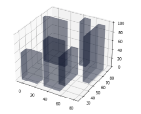

# Rapidly Exploding Random Tree

### Google Drive link for videos of simulation: [Link](https://drive.google.com/drive/folders/1G4tYQBkde1AEr6it_nONotADi-ubwWYN?usp=sharing)

## Non-holonomic RRT for differential drive

##### Goal:
Implement the RRT path planning algorithm for a non-holonomic robot.
    The robot is to navigate a two dimensional space, avoiding collisions with obstacles, travelling from its initial location to a goal location. Given exact localization information (robot’s initial position, obstacle location, goal location), your task is to implement a path planning decision maker to drive the robot from its initial position to the desired location using RRT. You can show the robot as a point in the simulations instead of showing the robot body. 
    You are required to test your algorithm on the following:
    1. 
    

        
         <b>Figure 1:</b> Test environment: Blue star denotes start position, green star denotes goal position. Obstacles are shown in red.
    

 2. Custom environments: Generate at least 1 custom environment, choosing the obstacle positions, number of obstacles, robot start and goal positions by yourself Submit the simulations in this custom environment.

        

   
#### Outputs:
Two videos for each of the above cases, (1) showing the evolution of your RRT tree and the generated platform centre trajectory, and (2) showing the trajectories of the left and right wheels along with the platform centre trajectory.

#### Summary of RRT: 
The robot used here is a differential drive non-holonomic robot which means that the left and right wheel velocities are not coupled. The RRT algorithm is used here to do collision avoidance and reach the goal position. A brief explanation of the algorithm is as follows:
1. First we get a random configuration for the robot using the random function.
2. Then from the already generated part of the tree, connect the tree towards the random configuration which is nearest to it and store each connection or we extend the already existing tree if they are in the same direction of the closest node.
3. We ignore the randomly generated configuration if the edge generated or the node generated lies in a obstacle.
4. Set a threshold for the finish position within which if a node reaches, then it is said to have reached the goal.

#### Summary of generating the path:
1. As we store each node’s parent link, we start to traverse back from the last generated node till we reach the initial position in an iterative manner.

##### Relations:

        
        
        

##### Results: 
1. Output of trajectory with the trees generated: 

        

2.  

        

3. Output trajectory of the wheels following the path generated:

        

We see that the obstacles have been avoided while traveling from the start to end position even when the wheel distances are considered thereby validating the algorithm’s working.

## Holonomic RRT for quadrotor UAV

##### Goal:
The goal of this task is to implement the RRT path planning algorithm for a quadrotor UAV.

The quadrotor is to navigate a three dimensional space, avoiding collisions with obstacles, travelling from its initial location to a goal location. 
Given exact localization information (robot’s initial position, obstacle location,goal location), your task is to implement a path planning decision maker to drive the robot from its initial position to the desired location using RRT.

You can show the robot as a point in the simulations instead of showing the robot body. You are required to sample pitch (θ), roll(φ) and thrust T assuming a fixed yaw(ψ) to derive acceleration command, and use acceleration control (tune suitable constants) for finding the quadrotor position.

You are required to test your algorithm on the following:
1. 
    

        
         <b>Figure 1:</b> Test environment: UAV is required to go from (0,0,0) to (100,100,100).
    

 2. Custom environments: Generate at least 1 custom environment, choosing the obstacle positions, number of obstacles, robot start and goal positions by yourself. Submit the simulations in this custom environment.

        

#### Outputs:
A video simulations for each of the above cases for the quadrotor trajectory, and the plots of θ, φ and T.

#### Summary of the algorithm:
The fundamental idea of the algorithm remains the same. The difference is in the implementation of drone dynamics with its holonomic  constraints.
1. Get a random goal in greedy fashion, then find the closest node to goal and then get velocity at that node.
2. Check the range of input values and coordinates that each possible input takes the drone to and then iterate through the $\phi$ and $\theta$ values to see where they end up. 
3. We select the next node also in a greedy fashion with min distance to goal.
4. Then we update the acceleration with curren chosen input
5. Then with the acceleration, we update the current velocity, position and add the node to the tree.
6. After expanding the tree we now move on to getting to the actual goal.

##### Relations:
1. <b>Acceleration:</b>
    a) Ax = -cos(phi)*sin(theta)*T/m
    b) Ay = sin(phi)*T/m
    c) Az = -g + cos(phi)*cos(theta)*T/m
2. <b>Velocity Update:</b>
    a) Vx(t) = Vx(t-1) + Ax*dt
    b) Vy(t) = Vy(t-1) + Ay*dt
    c) Vz(t) = Vx(t-1) + Az*dt
3. <b>Acceleration Control:</b>
    a) X(t) = X(t-1) + Vx*dt
    b) Y(t) = Y(t-1) + Vy*dt
    c) Z(t) = Z(t-1) + Vz*dt

##### Results:

        

<b>Output of trajectory generated:</b>

        

We see that the obstacles have been avoided while traveling from the start to end position.  

        

